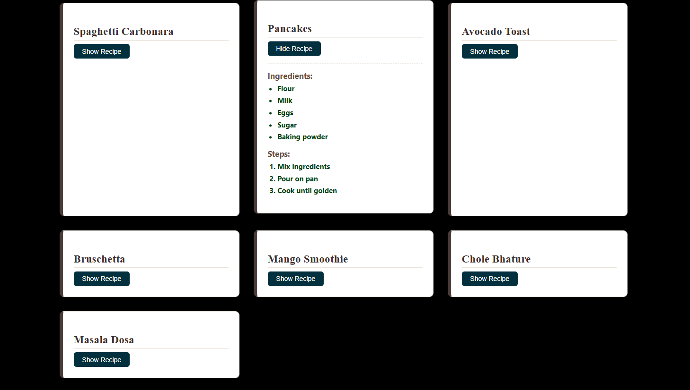

# 🍽️ Recipe Book Website

A beautiful **Recipe Book** built with React, allowing users to explore and view recipes, including ingredients and steps.

---

## 📌 Features
- ✅ **Browse Recipes**: View various recipes with ingredients and steps.
- ✅ **Expandable Recipe Details**: Show/hide recipe details by clicking a button.
- ✅ **Modern UI**: Clean, responsive design.
- ✅ **No Backend**: Fully front-end and self-contained.

---

## 🛠️ Technologies Used
- ⚛️ **React**
- 🎨 **CSS** (`Recipe.css` for styling)

---

## 🚀 Live Demo
To see it in action, clone the repository and follow the setup instructions below.

1. *Clone the repository:*

   ```bash
   git clone https://github.com/Eshhaa11/recipe-book-website

2. *Navigate to the project directory:*

   cd recipe-book-website

3. *Install dependencies:*

   npm install

4. *Start the development server:*

   npm start

5. *Open your browser and visit:*

   http://localhost:3000

---

 ## 🎨 Screenshots:
 


 ---

 ## 🤝 Contributing:
 Want to improve this project? Fork the repository, create a feature branch, and open a pull request. All contributions are welcome! 🚀✨
 
 ---

 🎉 Happy Coding!

